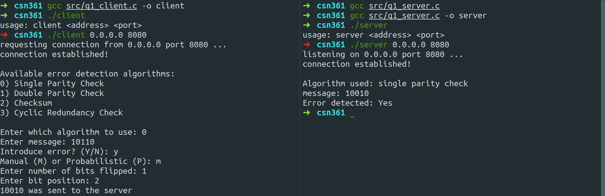
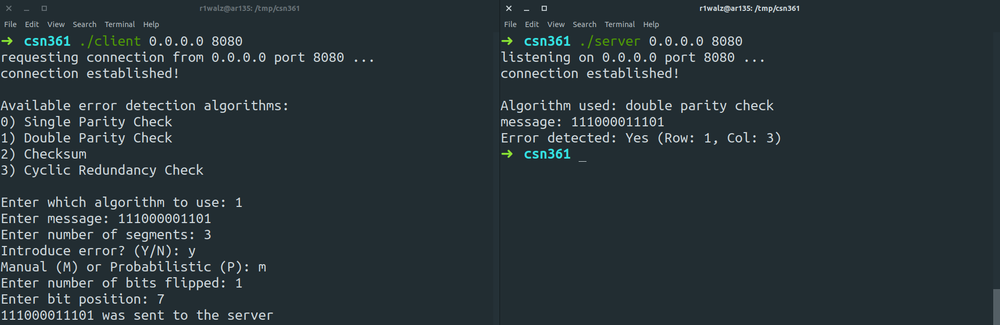
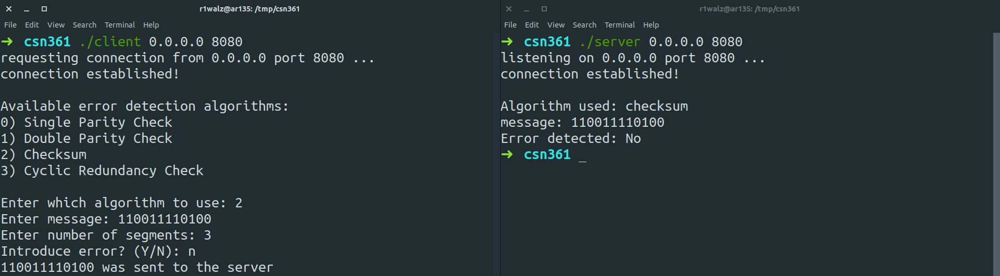
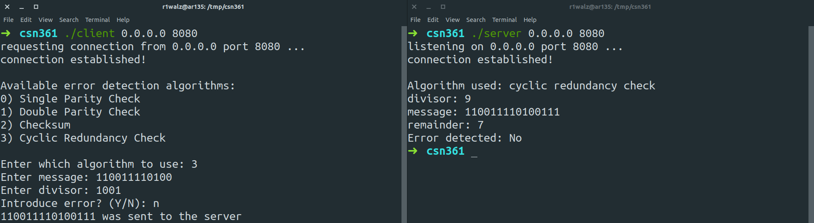
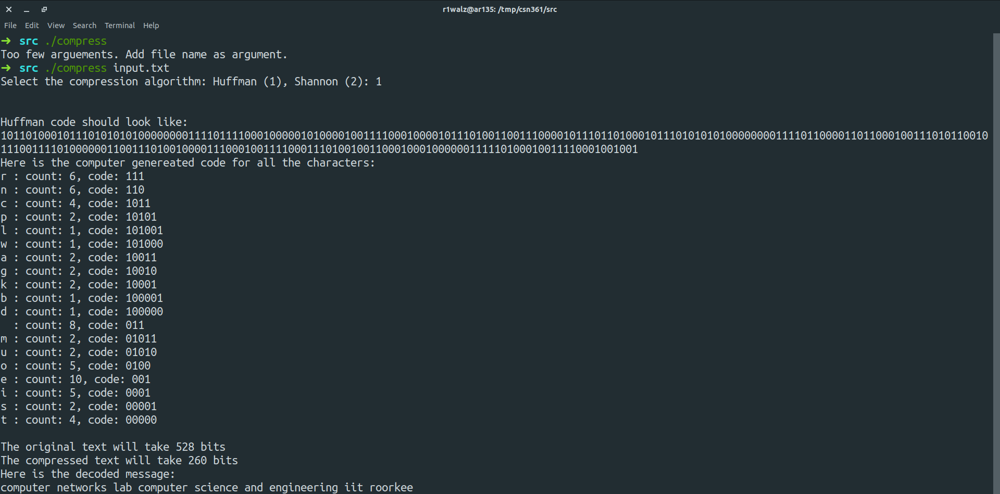
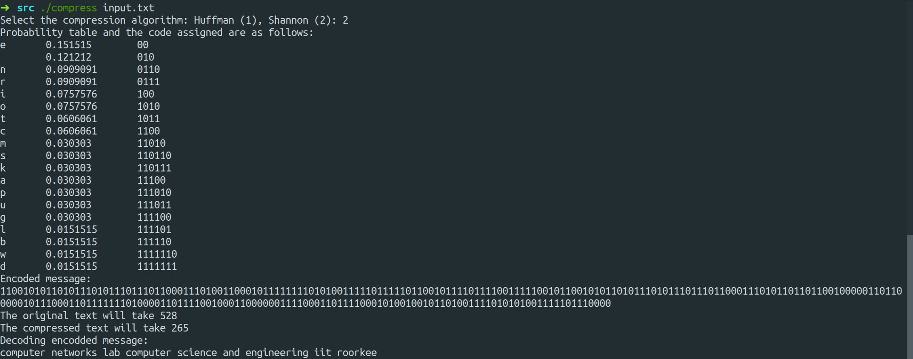

Name | Rohit Ashiwal
-|-
Enr. No. | 17114064
Dept | CSE
Batch | CS 2
Class | B. Tech. 3rd yr

# Lab Assignment 7

This assignment aims to make us familiar with the hardware and software aspects of computer networking and extracting information related to computer networking using C/C++ programs.

## Problem Statement 1

_**Q:** Transmit a binary message (from sender to a receiver) using socket programming in C and report whether the received msg is correct or not; using the following error detection algorithms:_
```md
1. Single Parity Check
2. Two-dimensional Parity Check
3. Checksum
4. Cyclic Redundancy Check (CRC)
```









Two data structures were used:
```md
1. enum algorithm: which couples all options for available error detection algorithms
2. struct pckt: which stores all information related to the data being transferred
```

All regular algorithms were implemented in their most naive form.

For adding probabilistic errors an array of random integers was generated with time(NULL) as seed to srand() and based on this array the bits of original message were flipped.

## Problem Statement 2

_**Q:** Transmit a binary message (from sender to a receiver) using socket programming in C. Using Hamming code detect and correct errors in the transmitted message, if any._

## Problem Statement 3

_**Q:** Write a C++ program to compress a message (non-binary, can be anything like a text message or a code like hexadecimal, etc.) using the following data compression algorithm:_
```md
1. Huffman
2. Shannon-Fano
```





No special algorithms or data structures were used.

Above graphs show that with the increase in queue size / bandwidth, the number of packets drop increase with some minor fluctuations.
